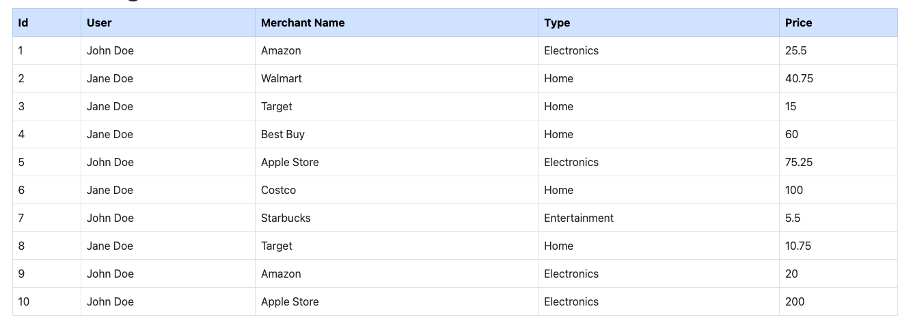
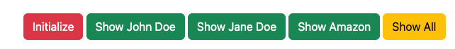

# Expense Tracking Exercise

The initial data that you will use to design your database with relationships can be fetched from http://143.42.108.232:8888/items/expenses.

When you run the project, the initial data will be fetched from the Noroff API and populate the table. This needs to be changed to use your database and display the data in the table.

Go through the json object recevied and design your database with sequelize and create the relationships.

Below image is a representation of the data that you should receive from the API call.

Once the database has been created with relationships. Create JSON files for each table and populate the tables with the relevant data.

The JSON file must include the SQL queries and use sequlelize.query() to populate the database.

On the index view there is a button called Initialize, this button must populate your database with the JSON data and raw SQL queries in the correct order.

After the data has been inserted into the database, continue to make the buttons functional.

When the buttons are clicked the results should update in the table. To show the results raw SQL queries must be made with sequelize.query.

The button actions have been added but you can remove or do it in your own way.

### Back-end Technologies that should be used in this exercise:
- Sequelize
- API Calls (axios, or fetch or another API library to get the initial data)
- MySQL (Relational database)
- ExpressJS to display the information